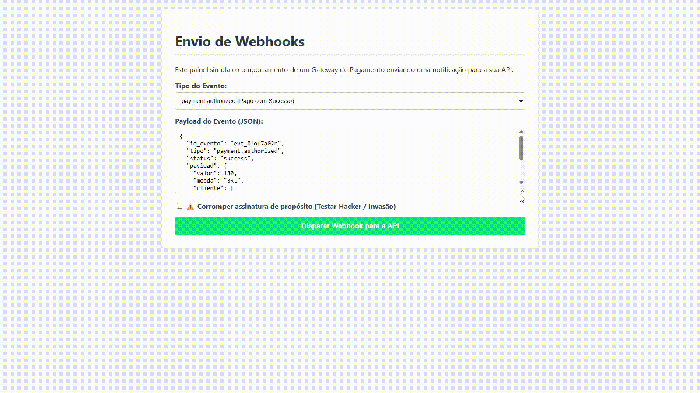

<h1 align="center">💳 Simulador de Gateway de Pagamentos — API de Webhooks & Segurança Avançada</h1>

<p align="center">
  O <strong>Simulador de Gateway de Pagamentos</strong> é uma aplicação backend robusta integrada a uma interface de testes, desenvolvida com foco em segurança criptográfica, integridade de dados e resiliência financeira (Idempotência).
</p>

<p align="center">
  Este projeto foi totalmente desenvolvido por mim, <strong>Jean Pedro</strong>.
</p>

<p align="center">
  
</p>

## 🎯 Objetivo

Este projeto foi desenvolvido com o objetivo de praticar e demonstrar a construção de arquiteturas de APIs seguras no padrão de produção de grandes players do mercado (como Stripe e Asaas), simulando o fluxo real de envio e recebimento de notificações de pagamento (Webhooks) de forma blindada contra fraudes.

## 🚀 Sobre o Projeto

Uma solução completa de ponta a ponta que simula um Gateway disparando eventos de transações (Aprovadas, Recusadas e Estornadas) para uma API Node.js. O projeto prioriza a segurança dos dados trafegados, tratamento rigoroso de concorrência e transparência no monitoramento via logs.

- 🔒 Validação Criptográfica rigorosa (HMAC SHA-256)  
- 🛡️ Sistema de Idempotência integrado (Anti-duplicação)  
- 🗄️ Persistência real em banco de dados relacional (Cloud)  
- 📊 Painel interativo para simulação de cargas e testes de invasão  

## 🛠️ Tecnologias Utilizadas

<p align="left">
  
</p>

- **Node.js & Express:** Core da API para criação de rotas estáveis e de alta performance  
- **TypeScript:** Tipagem estática garantindo previsibilidade e código livre de bugs em runtime  
- **PostgreSQL (Neon DB):** Banco de dados em nuvem para persistência dos eventos de pagamento  
- **Crypto (Node.js):** Módulo nativo para geração e checagem de hashes criptográficos complexos  
- **Git:** Versionamento e governança do código  

## ⚙️ Funcionalidades

- **Autenticação por Assinatura:** Middleware dedicado que descriptografa e valida o header `X-Webhook-Signature` antes de liberar a rota.  
- **Tratamento de Idempotência:** Trava inteligente no banco de dados que identifica IDs de eventos já processados, evitando duplo faturamento ou liberação duplicada de produtos.  
- **Roteamento de Regras de Negócio:** Sistema inteligente que ramifica o comportamento do backend de acordo com o status recebido (`success`, `failed`, `refunded`).  
- **Simulador Frontend Dinâmico:** Interface interativa injetada no próprio ecossistema do Express para testes funcionais em tempo real.  

## 💡 Diferenciais Técnicos

- **Zero CORS / Monolito Estático:** O Express atua servindo os arquivos estáticos da interface na mesma porta da API, eliminando problemas de cross-origin e blindando a comunicação local.  
- **Segurança de Credenciais:** Isolamento completo de variáveis sensíveis utilizando variáveis de ambiente que nunca são expostas no GitHub.  
- **Leitura do Raw Body:** Interceptação customizada do buffer nativo da requisição para garantir que o cálculo do hash SHA-256 seja perfeitamente idêntico ao gerado na origem.  
- **Logs de Terminal Semânticos:** Monitoramento visual detalhado através de emoticons e cores que separam fluxos normais de tentativas de invasão e duplicidade.  

## 📂 Estrutura de Pastas

```text
├── public/
│   ├── demonstracao.gif
│   └── index.html
├── src/
│   ├── config/
│   │   └── database.ts
│   ├── middlewares/
│   │   └── verifySignature.ts
│   └── index.ts
├── .env.example
├── .gitignore
├── package.json
└── tsconfig.json
